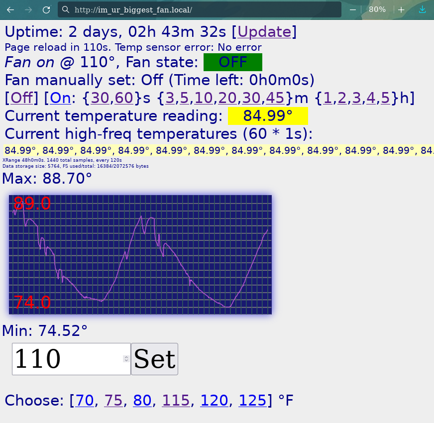

# Attic Fan Thermostat with WiFi Web Interface and OTA ability (via http)

by jaggz.h who is still using gmail.com  
2017-05-22




## Features:
1. Can probably work on nearly any ESP8266 setup. Presently I'm using a "D1 Mini", with a Relay Board. The relay board is set with RELAYPIN to D1 in the .ino and can be changed to your own.
2. Web interface
3. Over-the-Air (OTA) update (only via web access). Username/pw protected.
4. Keeps recent history of temperature readings, and graphs them on the web interface (360 samples, every 6 seconds == 6 hours at the time of this writing. Easily configured with #defines in the .ino).
5. Uses a DS18B20 sensor (on DALPIN in the .ino; presently D3). The sensor uses ground, 3.3v, and D3.
6. Program can use a DHT11 (which is awfully inaccurate and not recommended), and report humidity (mine have been absurdly inaccurate, but I've not tested the humidity calibration). Using a DHT11 requires compiling with the USE_DHT11 define uncommented. It's been a while since this feature was tested.
7. The SVG output (drawGraph()) is also an example of outputting data from the server in chunks, with unknown content length.  We use server.sendContent() to send our own HTTP header, with HTTP/1.0, without a content length, like this:

```cpp
server.sendContent("HTTP/1.0 200 OK\r\n");
server.sendContent("Content-Type: image/svg+xml\r\n\r\n");
```

## Usage:
1. Copy wifi_config--example.h to wifi_config.h and edit it accordingly.
2. Hit configured IP, and set the temperature, which defaults to 110 degF currently. The temperature is saved as f.txt in the ESP's SPIFF's filesystem.
3. You have to hook up the relay/relay board and the DS18B20 to the specified pins (see notes).

